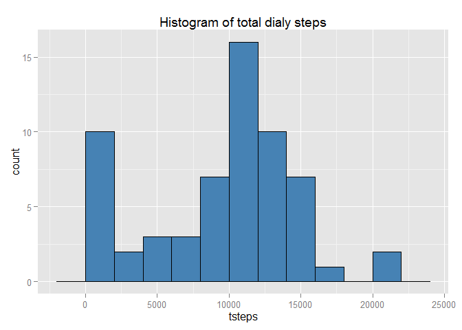
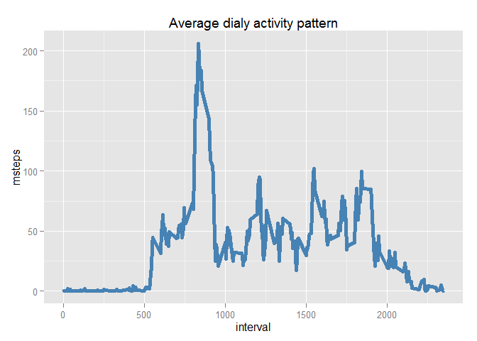
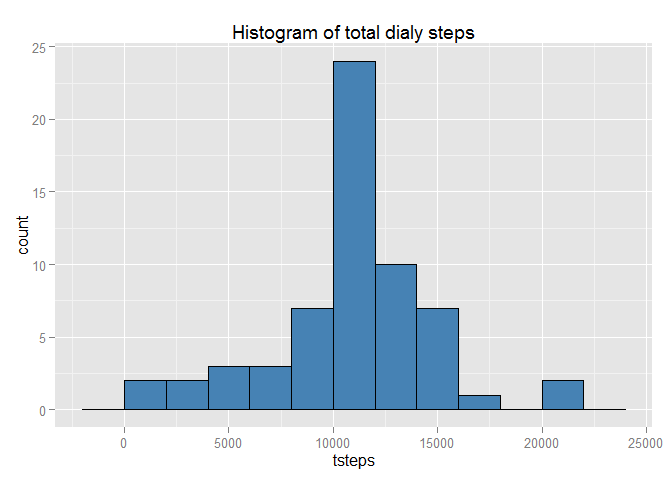
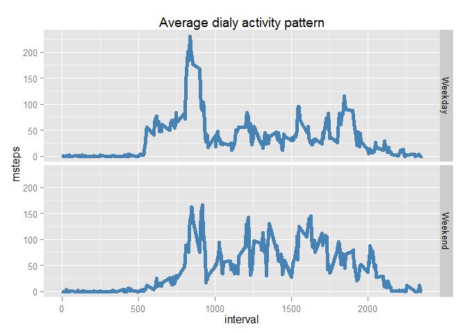

# Reproducible Research: Peer Assessment 1
Javier Santibáñez  
Sunday, December 14, 2014  


## Loading and preprocessing the data
First we have to read the data.

```r
setwd('D:/ScJavier/Coursera/Data Sciencie Specialization/05_Reproducible_Research/Course_Project_1/RepData_PeerAssessment1/')
if (!file.exists("activity.csv"))
  {
    unzip("activity.zip")
  }
data <- read.csv("activity.csv",stringsAsFactors=F)
summary(data)
```

```
##      steps            date              interval     
##  Min.   :  0.00   Length:17568       Min.   :   0.0  
##  1st Qu.:  0.00   Class :character   1st Qu.: 588.8  
##  Median :  0.00   Mode  :character   Median :1177.5  
##  Mean   : 37.38                      Mean   :1177.5  
##  3rd Qu.: 12.00                      3rd Qu.:1766.2  
##  Max.   :806.00                      Max.   :2355.0  
##  NA's   :2304
```
To process the data we'll use the `dplyr` package, to manage dates we'll use the `lubridate`, and to make the plot we'll use the `ggplot2` package.

```r
library(dplyr); library(lubridate); library(ggplot2)
```

```
## 
## Attaching package: 'dplyr'
## 
## The following object is masked from 'package:stats':
## 
##     filter
## 
## The following objects are masked from 'package:base':
## 
##     intersect, setdiff, setequal, union
```

```r
data<-tbl_df(data)
data<-mutate(data,date=ymd(date))
```

## What is mean total number of steps taken per day?
We have to plot an histogram of the total number of steps taken per day,so we have to sum of steps by days.


```r
plot1<-group_by(data,date) %>%
       summarise(tsteps=sum(steps,na.rm=T))
ggplot(plot1,aes(tsteps))+
  geom_bar(fill="steelblue",color="black",binwidth=2000)+
  labs(title="Histogram of total dialy steps")
```

 

```r
mean1<-round(mean(plot1$tsteps),0)
median1<-round(median(plot1$tsteps),0)
```

We have computed a mean value of total steps of 9354 and a median value of 1.0395\times 10^{4}.

## What is the average daily activity pattern?
Now, we have to compute the average dialy activity pattern, so we have to compute the mean of steps across days by 5-minutes interval.


```r
plot2<-group_by(data,interval) %>%
       summarise(msteps=mean(steps,na.rm=T))
ggplot(plot2,aes(interval,msteps))+
  geom_line(color="steelblue",size=2)+
  labs(title="Average dialy activity pattern")
```

 
Also, we have to find eh interval with the maximun of steps.

```r
max.steps<-arrange(plot2,desc(msteps))[1,]
```
The interval with the maximum number of steps is 835 iand it has 206.17 steps.

## Imputing missing values
1. First we have to compute the number of rows with `NA`'s.

```r
missvals<-sum(is.na(data$steps))
```
The number of row with `NA`'s is 2304.

2. To impute the missing values we'll replace `NA` in a given interval for the mean number of steps in that 5-minutes interval accros days rounding to the nearest integer.

3. Now, we have to create a new data set without missing values.


```r
data2<-data
for (i in 1:dim(data)[1])
{
  if (is.na(data[i,1]))
    {
      temp<-select(data,interval,steps) %>%
        filter(interval==as.numeric(data[i,3]))  %>%
        summarise(steps=mean(steps,na.rm=T))
      data2[i,1]<-temp
    } 
}
```

We can verify there are not missing values.

```r
summary(data2)
```

```
##      steps             date               interval     
##  Min.   :  0.00   Min.   :2012-10-01   Min.   :   0.0  
##  1st Qu.:  0.00   1st Qu.:2012-10-16   1st Qu.: 588.8  
##  Median :  0.00   Median :2012-10-31   Median :1177.5  
##  Mean   : 37.38   Mean   :2012-10-31   Mean   :1177.5  
##  3rd Qu.: 27.00   3rd Qu.:2012-11-15   3rd Qu.:1766.2  
##  Max.   :806.00   Max.   :2012-11-30   Max.   :2355.0
```

4. Finally, we have to make an histogram of the total of steps taken per day without missing values and we have to compute the new mean and median.

```r
plot3<-group_by(data2,date) %>%
       summarise(tsteps=sum(steps,na.rm=T))
ggplot(plot3,aes(tsteps))+
  geom_bar(fill="steelblue",color="black",binwidth=2000)+
  labs(title="Histogram of total dialy steps")
```

 

```r
mean2<-round(mean(plot3$tsteps),0)
median2<-round(median(plot3$tsteps),0)
```
- The original mean of total steps was 9354, now, without missing values the mean is 1.0766\times 10^{4}. The second value is greater than the first one.
- The original median of total steps was 1.0395\times 10^{4}, now, without missing values the median is 1.0766\times 10^{4}. The values do not seem too different.
- The main difference after imputation is that the distribution of the data is more symmetric.

## Are there differences in activity patterns between weekdays and weekends?

Finally we have to compare the daily pattern of steps of weekdays against weekends.


```r
data2$day<-rep(0,dim(data2)[1])
for (i in 1:dim(data2)[1])
{
  if (wday(data2$date[i]) %in% c(1,7))
  {
    data2$day[i]<-"Weekend"    
  }
  if (wday(data2$date[i]) %in% c(2:6))
  {
    data2$day[i]<-"Weekday"    
  }
}
data2<-mutate(data2,day=as.factor(day))

plot4<-group_by(data2,day,interval) %>%
  summarise(msteps=mean(steps))

ggplot(plot4,aes(interval,msteps))+
  geom_line(color="steelblue",size=2)+
  facet_grid(day~.)+
  labs(title="Average dialy activity pattern")
```

 


